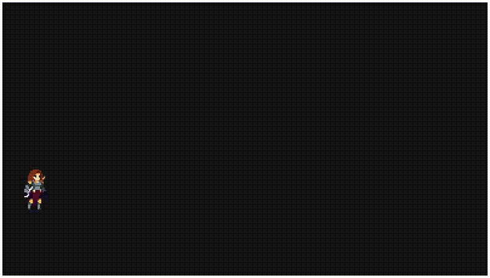

## Demo


## Build
To build the project, use the provided `Makefile`:
1. Open a terminal and navigate to the project directory.
2. Run the following command:
```sh
make
```
By default, this will generate an executable named `game`, as specified in the 
`Makefile`

## Run
To run the game, execute the following command in the terminal:
```sh
./game
```
Ensure you are in the project directory to executable the game correctly.
